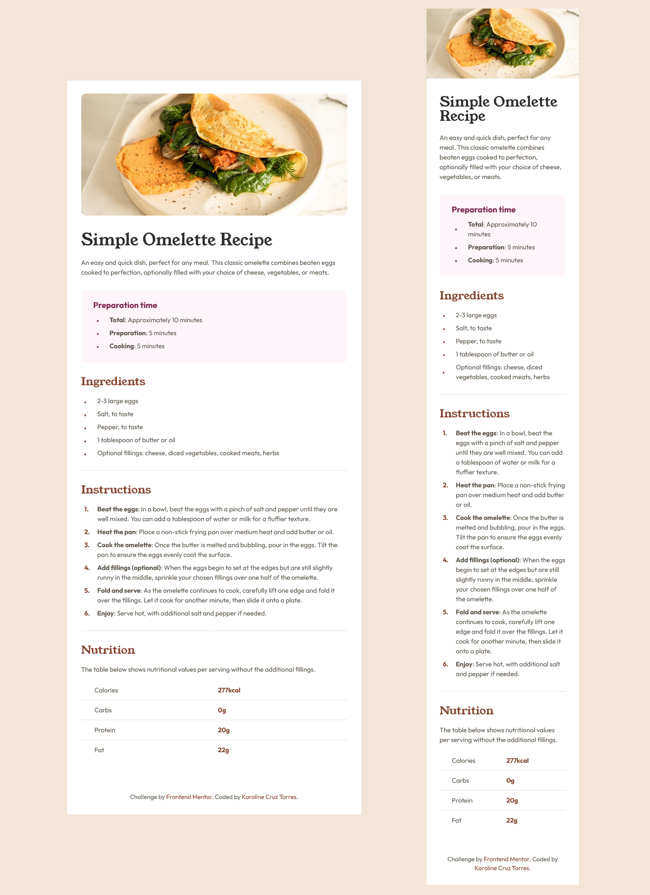

# Frontend Mentor - Recipe page solution

This is a solution to the [Recipe page challenge on Frontend Mentor](https://www.frontendmentor.io/challenges/recipe-page-KiTsR8QQKm). Frontend Mentor challenges help you improve your coding skills by building realistic projects.

## Table of contents

- [Overview](#overview)
  - [Built with](#built-with)
  - [What I learned](#what-i-learned)
  - [Solution](#solution)
  - [Screenshot](#screenshot)
  - [Continued development](#continued-development)
  - [Useful resources](#useful-resources)
- [Author](#author)

## Overview

### Built with

- HTML5, CSS, mobile-first workflow

### What I learned

- As my first responsive design project, I learned a lot about media queries and <source> to optimize the UX on different devices.
- I was also able to reinforce knowledge about @font-face, semantics and clean code practices for better legibility and maintainability.

### Solution

- Check my solution: [Solution URL](https://karolinecruztorres.github.io/recipe-page/)

### Screenshot

### Continued development

- I'll to improve the accessibility and the UX of this code by adding ARIA attributes and the possibility to switch to dark theme.
- In the future I will integrate a database so that the code can be reusable and a little javascript to make it visually appealing.

### Useful resources

- [A practical guide to responsive web design](https://www.youtube.com/watch?v=x4u1yp3Msao&t=425s) - This video helped me better understand the basics of responsiveness and apply them to the hero image.

## Author

- [GitHub](https://github.com/karolinecruztorres)
- [Frontend Mentor](https://www.frontendmentor.io/profile/karolinecruztorres)
- [LinkedIn](https://www.linkedin.com/in/karoline-cruz-torres/)
